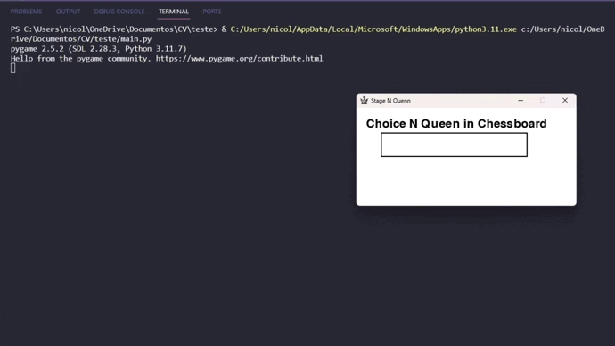
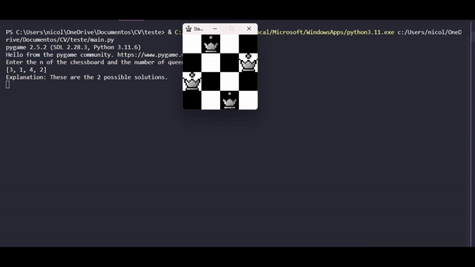

# N-Queens Solver - Stage Consulting Test

## Description
The n-queens puzzle is the problem of placing n queens on a (n×n) chessboard such that no two queens can attack each other. Given an integer n, find all distinct solutions to the n-queens puzzle. Each solution contains distinct board configurations of the n-queens’ placement, where the solutions are a permutation of [1,2,3..n] in increasing order, where the number in the ith place denotes that the ith-column queen is placed in the row with that number.

## Usability
When start the application, there will be a message box asking for the value of N. Only integer values above 0 will be accepted. After entering the value and pressing Enter, a window with the generated interface will open.

Press the space bar to switch between different solutions presented on the screen.

## Examples
### Example 1:
**Input:**

N = 1

**Output:**

[1]

Explanation: Only one queen can be placed in the single cell available.

### Example 2:
**Input:**

N = 4

**Output:**

[3, 1, 4, 2]

Explanation: These are the 2 possible solutions.

[2, 4, 1, 3]

Explanation: These are the 2 possible solutions.
## Task
The task is to complete the chessboard which takes `n` as input parameter and returns a list containing all the possible chessboard configurations in sorted order. Return an empty list if no solution exists.

## How to Install
Before running the N-Queen solver, ensure you have the following dependencies installed:

- [Python](https://www.python.org/downloads/): The script requires Python to run.
- [pip](https://pip.pypa.io/en/stable/installation/): The Python package installer is needed to install project dependencies.

### Optional: Make
- [Make](https://www.gnu.org/software/make/): Make is used to simplify the build process.

#### On Linux
1. Install Make: `sudo apt-get install make`

### Optional: Using Makefile
1. Clone the repository: `git clone git@github.com:noccss/Stage_Queen_Test.git`
2. Install dependencies with Makefile: `make install`

### Alternative Installation without Make
1. Clone the repository: `git clone git@github.com:noccss/Stage_Queen_Test.git`
2. Install the dependency with pip: `pip install pygame`

If you don't have pip installed, you can follow the [official installation guide](https://pip.pypa.io/en/stable/installation/) to get it.

## How to Run the Application
- Using Make: `make run`
- Without Make: `python ./main.py`

## Contact
For more information about the project, you can send an email to: [nicolas.olicarvalho@gmail.com](mailto:nicolas.olicarvalho@gmail.com).
